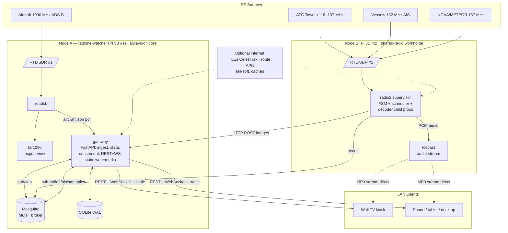
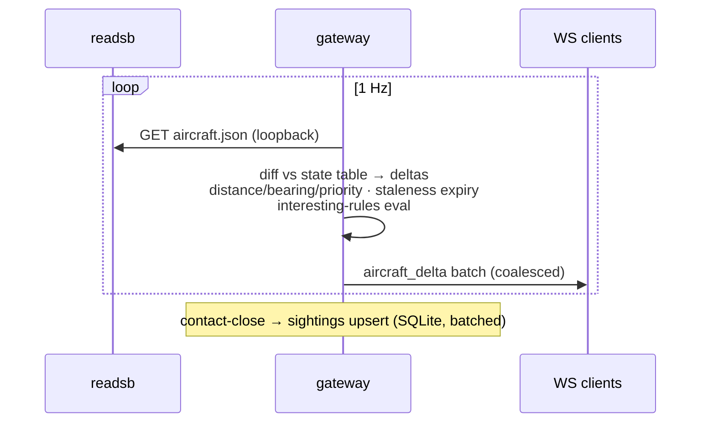
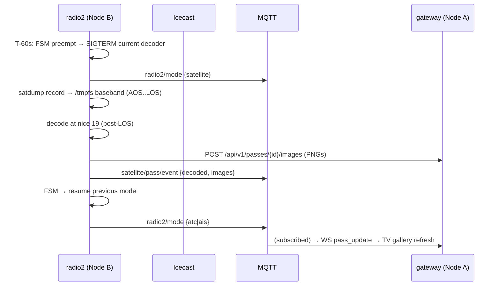

# Architecture: build-rpi-aviation-platform

**Status:** Accepted baseline · **Date:** 2026-06-12
**Reference topology:** two-node Pi 3B (per 02_CODE_RESEARCH addendum + ADR-001)

---

## 1. System Context Diagram



**Trust/network boundary:** everything inside one LAN. No WAN listener. Internet is outbound-only, optional, fail-soft.

---

## 2. Component Design

### Node A (4 containers)

| Component | Container | Responsibility | Never does |
|---|---|---|---|
| **readsb** | `readsb` | Own SDR #1 exclusively; decode 1090 MHz; expose `aircraft.json` + Beast :30005 | Anything else. No bus client (adapter pattern: gateway polls) |
| **tar1090** | `tar1090` | Expert/fallback ADS-B map on `:8078` | Serve the primary UI |
| **Mosquitto** | `mosquitto` | MQTT broker `:1883` (LAN-bound); retained state; LWT liveness | Persistence to disk for high-rate topics (in-memory queues; retained only for state topics) |
| **gateway** | `gateway` | The product's brain: ADS-B ingest (poll readsb 1 Hz) → state table → prioritization → interesting-rules; enrichment (local DB + cached online); MQTT sub for radio2/AIS/satellite topics; REST API + WS fan-out; serves React static bundle + satellite media; SQLite owner; retention jobs | Own any SDR; decode anything |

### Node B (2 containers)

| Component | Container | Responsibility | Never does |
|---|---|---|---|
| **radio2** | `radio2` | Single owner of SDR #2. Supervisor process (Python/FastAPI-less asyncio) runs: orchestrator FSM, Skyfield pass scheduler, TLE cache/refresh, and **spawns exactly one decoder child process at a time** (`rtl_airband` \| `AIS-catcher` \| `satdump`). Normalizes decoder output → MQTT. Pushes finished satellite PNGs to gateway via HTTP. Local health endpoint `:9090` | Talk to browsers (except via bus/gateway); persist long-term state (Node A owns the DB) |
| **Icecast** | `icecast` | Receive rtl_airband stream; serve MP3 to browsers `:8000` | Transcode; record |

**Key simplification (ADR-004):** because the two-node split co-locates orchestrator and decoders, the three Radio-#2 decoders run as **supervised child processes inside the `radio2` container** — not separate containers. Device handoff becomes plain process lifecycle (SIGTERM → wait → exec next). The cross-container device-token protocol from research is **obsolete** — deleted complexity.

### Frontend (built artifact, served by gateway)

| Module | Responsibility |
|---|---|
| `ws-client` | Single WS connection; auto-reconnect w/ backoff; snapshot-then-delta protocol |
| `views/tv` | Kiosk rotation: hero → map → latest satellite → stats. No interaction. Leaflet-canvas |
| `views/interactive` | Responsive list/detail/map/audio/gallery/analytics/system |
| `state` | Zustand store fed exclusively by WS messages |

---

## 3. Data Model (SQLite, Node A, WAL)

```sql
-- one row per aircraft contact session (first..last seen continuum)
CREATE TABLE sightings (
  id INTEGER PRIMARY KEY,
  icao TEXT NOT NULL,                 -- hex
  callsign TEXT, registration TEXT, type_code TEXT,
  first_seen INTEGER NOT NULL,        -- unix s
  last_seen INTEGER NOT NULL,
  min_distance_km REAL, max_range_km REAL,
  max_alt_ft INTEGER, msg_count INTEGER DEFAULT 0,
  flags TEXT DEFAULT '',              -- csv: military,emergency,watchlist
  squawk_emergency TEXT               -- 7500/7600/7700 if seen
);
CREATE INDEX idx_sightings_seen ON sightings(last_seen);
CREATE INDEX idx_sightings_icao ON sightings(icao, last_seen);

CREATE TABLE vessels_seen (
  mmsi INTEGER PRIMARY KEY,
  name TEXT, ship_type INTEGER,
  first_seen INTEGER, last_seen INTEGER,
  last_lat REAL, last_lon REAL, last_sog REAL
);

CREATE TABLE satellite_passes (
  id INTEGER PRIMARY KEY,
  satellite TEXT NOT NULL,            -- NOAA-19, METEOR-M2-3...
  aos INTEGER, los INTEGER,           -- acquisition/loss of signal
  max_elevation REAL,
  status TEXT CHECK(status IN ('scheduled','captured','decoded','failed')),
  image_paths TEXT,                   -- json array, relative to media root
  quality_note TEXT
);

CREATE TABLE enrichment_cache (
  icao TEXT PRIMARY KEY,
  registration TEXT, type_code TEXT, type_name TEXT,
  operator TEXT, country TEXT, route TEXT, photo_url TEXT,
  source TEXT, fetched_at INTEGER, ttl_s INTEGER
);

CREATE TABLE hourly_rollups (
  hour INTEGER PRIMARY KEY,           -- unix hour
  aircraft_count INTEGER, msg_count INTEGER,
  max_range_km REAL, unique_types INTEGER
);

CREATE TABLE schema_version (version INTEGER NOT NULL);
```

**Write budget:** sightings upserted on contact-close (staleness) or every 60 s batch, not per-message. Rollups hourly. Live positions/trails are **RAM-only** (gateway process). Target < 1 GB/day (NFR-6).

---

## 4. API Design (gateway, Node A)

### REST (read + light config)
| Endpoint | Returns | Codes |
|---|---|---|
| `GET /api/v1/aircraft` | live aircraft array (state table snapshot) | 200 |
| `GET /api/v1/aircraft/{icao}` | one aircraft + enrichment + trail | 200/404 |
| `GET /api/v1/vessels` | live vessels | 200 |
| `GET /api/v1/radio2` | `{mode, since, next_pass, schedule, healthy}` | 200 |
| `POST /api/v1/radio2/mode` | manual override `{mode, duration_s?}` → 202; `{mode:"auto"}` releases | 202/409/422 |
| `GET /api/v1/passes?status=&limit=` | satellite pass list + image URLs | 200 |
| `POST /api/v1/passes/{id}/images` | **(Node B only)** multipart PNG upload | 201/404/413 |
| `GET /api/v1/history/sightings?from=&to=&flag=` | paginated (cursor) sighting log | 200 |
| `GET /api/v1/stats/range`, `/api/v1/stats/hourly` | analytics aggregates | 200 |
| `GET /api/v1/system` | node health: SDRs, decoders, disk, CPU temp/throttle, node B liveness | 200 |
| `GET /api/v1/config` / `PUT /api/v1/config/watchlist` | safe-subset config | 200/422 |
| `GET /media/satellite/{file}.png` | static images | 200/404 |
| `GET /healthz` | liveness | 200 |

Errors: RFC-7807 problem+json `{type,title,status,detail}`. `409` on mode override when a satellite pass is in progress (pass wins unless `force:true`).

### WebSocket `GET /ws` (single endpoint, message-typed)
Server→client message envelope (see PROJECT_SPEC for full types):
`snapshot`, `aircraft_delta`, `aircraft_removed`, `vessel_delta`, `radio2_status`, `atc_activity`, `interesting`, `pass_update`, `system_health`. Client→server: `subscribe` (topic filter list), `ping`.
Protocol: on connect → full `snapshot`, then deltas at ≤1 Hz coalesced batches. Heartbeat 30 s.

---

## 5. Event Bus Design (MQTT topic tree)

| Topic | QoS | Retained | Payload (JSON) | Publisher |
|---|---|---|---|---|
| `adsb/interesting` | 1 | no | `{icao, severity, rule, callsign, ts}` | gateway |
| `radio2/mode` | 1 | **yes** | `{mode, since, reason, pid}` | radio2 |
| `radio2/pass/next` | 1 | **yes** | `{satellite, aos, los, max_el}` | radio2 |
| `radio2/health` | 1 | **yes** (LWT) | `{ok, decoder, uptime_s}`; LWT → `{ok:false,reason:"offline"}` | radio2 |
| `atc/activity` | 0 | no | `{channel_mhz, active, ts}` | radio2 |
| `ais/vessel` | 0 | no | `{mmsi, lat, lon, sog, cog, name?, type?, ts}` | radio2 |
| `satellite/pass/event` | 1 | no | `{pass_id, satellite, status, images?[], ts}` | radio2 |
| `sys/{node}/health` | 1 | **yes** (LWT) | `{ok, cpu_pct, mem_mb, temp_c, throttled, ts}` | each node |

**Deliberate scope-cut:** high-rate ADS-B aircraft positions do **not** transit MQTT — readsb and the gateway are co-located on Node A; the gateway polls `aircraft.json` at 1 Hz directly (loopback). The bus carries *cross-node* and *notification* traffic only. This keeps broker throughput trivial (<20 msg/s worst case) and Node A's path RAM-cheap.
**Liveness for free:** retained + Last-Will on `radio2/health` and `sys/*/health` means the dashboard knows Node B is gone within keepalive (15 s) with zero polling code.

---

## 6. Data Flow Diagrams

### ADS-B (hot path, all Node A)


### Satellite pass (cross-node)


### Mode switch FSM (radio2 supervisor)
```
        ┌────────── manual override (API→MQTT cmd) ──────────┐
        ▼                                                     │
 IDLE → STARTING(mode) → RUNNING(mode) → STOPPING → STARTING(next)
            │ start fail ≤3 retries          ▲
            ▼ backoff 5/15/60s               │ pass AOS-60s preempt
        FAULTED(mode) ── skip to next scheduled mode
 Invariants: exactly one child proc may hold SDR#2 (enforced: spawn only after
 prior child waitpid confirms exit). Watchdog: RUNNING without child heartbeat
 30s → STOPPING. Max satellite mode duration: LOS+10min hard timeout.
```

---

## 7. State Management Model

| State | Lives in | Durability | Restart behavior |
|---|---|---|---|
| Live aircraft table + trails | gateway RAM (dict, ring buffers) | none — rebuildable | repopulated from readsb within ~2 polls (<5 s); WS clients get fresh `snapshot` |
| Live vessels | gateway RAM | none | repopulates as AIS messages arrive (intermittent — acceptable gap) |
| Radio-2 mode/schedule/next-pass | radio2 RAM + **MQTT retained** | broker-held | gateway/UI re-learn instantly from retained topics; radio2 itself recomputes schedule from config + TLE cache on boot |
| Pass schedule/TLEs | radio2 RAM + TLE file cache (volume) | file | recompute on boot; stale >14 d → warning event |
| Sightings/rollups/passes/enrichment | SQLite (Node A volume) | durable, WAL | crash-safe; ≤60 s loss window (batch interval) |
| Satellite images | Node A media volume | durable | pruned by retention job (keep last 50 passes) |
| Frontend state | Zustand, fed by WS only | none | reconnect → snapshot → rebuild |

**Principle:** *every* RAM state is reconstructible from (source-of-truth poll ∨ retained MQTT ∨ SQLite). No state exists only in transit → restart-safe by construction.

---

## 8. Persistence Model

- **SQLite, WAL, `synchronous=NORMAL`** — single writer (gateway), readers via same process. No cross-process DB access (radio2 ships data via HTTP/MQTT, never touches the DB).
- **Volumes:** `gateway-data` (db + media), `radio2-data` (TLE cache, configs), `mosquitto-data` (retained store). Everything else `tmpfs`: baseband capture (≤400 MB), rtl_airband buffers, container logs (json-file `max-size=10m,max-file=3`).
- **Retention jobs (gateway, daily 04:00):** sightings >30 d delete; passes >50 prune images+rows; enrichment TTL sweep; `PRAGMA incremental_vacuum`.
- **Backup:** `sqlite3 .backup` to media volume weekly, keep 2 (documented, optional).

---

## 9. Failure Handling & Recovery Strategy

| Failure | Detection | Handling | Recovery |
|---|---|---|---|
| readsb crash / SDR1 unplug | container exit / json poll fails ×3 | compose `restart: unless-stopped`; gateway marks adsb degraded → WS `system_health` | auto-restart; udev rule retriggers; aircraft table rebuilds in seconds |
| gateway crash | healthz / container exit | restart; clients' WS reconnect-backoff | snapshot protocol rebuilds clients; ≤60 s sightings loss (batch) |
| Mosquitto down | LWT n/a (it IS the bus); gateway pub fails | gateway buffers nothing (bus is notification-only); UI loses Node-B freshness, ADS-B unaffected | restart; retained topics restore instantly |
| **Node B offline** (power/net) | `radio2/health` LWT fires ≤15 s | UI shows modes unavailable; gateway keeps serving everything Node-A | on boot: FSM recomputes schedule, resumes priority mode; retained topics refresh |
| Decoder child crash (Node B) | waitpid + heartbeat | FSM: FAULTED → retry ×3 backoff → skip to next mode + `radio2/health{ok:false}` | next schedule slot retries faulted mode |
| SDR2 unplug | child exits + open fails | FSM → FAULTED all modes; alert event | udev replug → FSM retry succeeds; no container restart needed |
| Satellite decode OOM (1 GB Pi) | child OOM-killed | pass marked `failed` w/ note; APT preferred profile default; LRPT behind config flag | next pass retries; user guidance in docs |
| Stuck mode / FSM wedge | watchdog: RUNNING w/o heartbeat 30 s; satellite hard-timeout LOS+10 min | force STOPPING (SIGKILL escalation 10 s) | continue schedule |
| SQLite corruption | integrity_check on boot | restore latest backup; if none, recreate (summaries are losable, not precious) | documented runbook |
| Internet gone | enrichment/TLE fetch fail | fail-soft: cached/local-DB values; TLE staleness >14 d → UI warning | opportunistic refresh on success |

**Restart-safety invariant:** any single container or either node may be power-cycled at any moment; the system converges to correct state without manual action (chaos test in CI plan).

---

## 10. Performance Strategy & Resource Allocation

### Budgets (Pi 3B: 4×Cortex-A53 1.2 GHz, 1 GB)

**Node A** (target steady ≤55% CPU, ≤600 MB):
| Service | RAM cap (compose) | CPU expectation |
|---|---|---|
| readsb | 128 MB | 10–18% (1090 busy airspace) |
| gateway | 256 MB | 8–15% (1 Hz diff + ≤5 WS clients) |
| mosquitto | 32 MB | <1% |
| tar1090 | 64 MB | ~1% idle (on-demand) |
| OS headroom | ~350 MB free | — |

**Node B** (bursty by design):
| Service | RAM cap | CPU expectation |
|---|---|---|
| radio2 + rtl_airband | 128 MB | 20–35% (2ch AM) |
| radio2 + AIS-catcher | 128 MB | 10–20% |
| radio2 + satdump APT decode | **512 MB** | 100% ×2 cores, 2–4 min post-pass (nice 19) |
| satdump METEOR LRPT | 512 MB cap — **flagged experimental on 1 GB** | may OOM; config-gated off by default |
| Icecast | 32 MB | <2% |

**Tactics:** coalesced WS deltas (1 Hz batch, not per-aircraft); enrichment lazily on first sight + LRU; trails capped 100 pts; Leaflet canvas renderer; satellite images downscaled to 1080p-max for gallery (originals kept until pruned); gzip static; no polling anywhere in the browser.

### Scalability notes
- **10× clients (50 WS):** gateway fan-out is the bottleneck → move WS broadcast to `uvicorn` multiple workers w/ shared bus or the Go escape hatch (ADR-003). Architecture unchanged.
- **10× traffic (busy-airspace antenna upgrade):** readsb fine; gateway diff cost grows linearly — drop poll to 2 s or switch to Beast TCP streaming ingest. SQLite untouched (summary writes scale with *contacts*, not messages).
- **100×:** wrong product tier — that's a feeder-network node, explicitly out of scope.

---

## 11. Security Boundaries

| Boundary | Control |
|---|---|
| WAN ↔ LAN | **No listener exposed**; docs warn against port-forwarding; outbound-only HTTPS for enrichment/TLE |
| LAN ↔ services | gateway `:8080`, Icecast `:8000`, tar1090 `:8078` bound to LAN; MQTT `:1883` bound to **node-internal + Node A↔B only** (compose network + host firewall rule); no auth in v1 (trusted-LAN assumption, ADR consequence — documented) |
| Node B → gateway image upload | shared-secret header (`X-Node-Key`, from `.env`, not in images) — prevents LAN guests writing media |
| Containers ↔ host | no `--privileged`; SDR via `device_cgroup_rules` + specific `/dev/bus/usb` paths; read-only rootfs where possible; `no-new-privileges:true`; non-root users in our images |
| Secrets | `.env` (gitignored) for node key + optional API keys; gitleaks pre-commit per repo policy |
| Supply chain | upstream decoder images pinned by digest; monthly rebuild; multi-arch build in CI |

---

## 12. Monorepo Structure

```
sdr-telemetry-node/
├── docker/
│   ├── node-a/compose.yml          # readsb, tar1090, mosquitto, gateway
│   ├── node-b/compose.yml          # radio2, icecast
│   ├── readsb/Dockerfile           # thin wrappers, pinned digests
│   ├── radio2/Dockerfile           # python + rtl_airband + AIS-catcher + satdump
│   └── gateway/Dockerfile
├── services/
│   ├── gateway/                    # FastAPI app
│   │   ├── app/{ingest,state,enrich,rules,api,ws,persist,jobs}/
│   │   └── tests/
│   └── radio2/                     # asyncio supervisor
│       ├── app/{fsm,scheduler,decoders,publish,upload}/
│       └── tests/
├── web/                            # React+Vite+TS
│   └── src/{views/tv,views/interactive,state,ws,components}/
├── shared/
│   ├── schemas/                    # JSON Schema: MQTT payloads + WS messages (single source)
│   └── config/config.example.yaml
├── data/aircraft-db/               # bundled offline enrichment DB + build script
├── scripts/{install.sh,flash-node-b.md,backup.sh}
├── docs/
└── .github/workflows/ci.yml        # lint, test (offline mode), multi-arch buildx
```

**Contract discipline:** `shared/schemas/*.json` is the single source for event/WS shapes; gateway (pydantic) and web (TS types) both codegen from it in CI — drift fails the build.

---

## 13. Dependency Map

```
web ──(WS/REST types)──► shared/schemas ◄──(pydantic models)── gateway ── SQLite
                                   ▲                              ▲  ▲
                                   └──────── radio2 ──────────────┘  │ (MQTT payloads)   (HTTP upload, MQTT)
upstream binaries: readsb, tar1090 (Node A) · rtl_airband, AIS-catcher, satdump, icecast (Node B)
python: fastapi, uvicorn, paho-mqtt, skyfield, pydantic, aiosqlite, httpx
web: react, vite, typescript, zustand, leaflet, react-leaflet
ZERO runtime deps: gateway→radio2 (only optional inputs) · readsb→anything · web→internet
```

---

## 14. Open items carried to /plan
- Confirm dongle `iProduct` (driver path final check — R-4)
- Node B OS bring-up runbook (second Pi 3B is bare)
- Validate METEOR-LRPT-on-1GB empirically in M4; APT-only default until proven
- tar1090-db licensing verification before bundling
